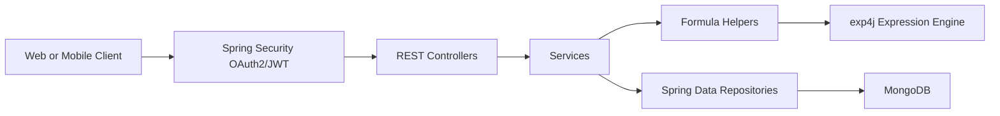
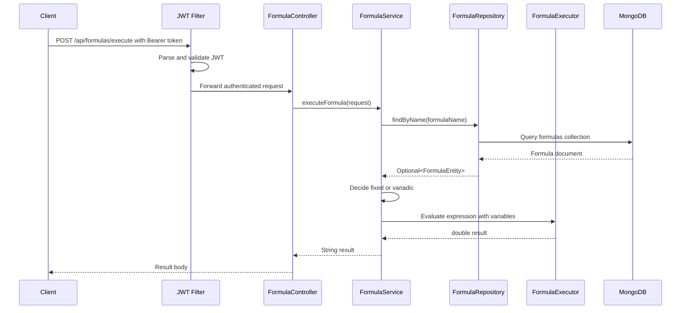
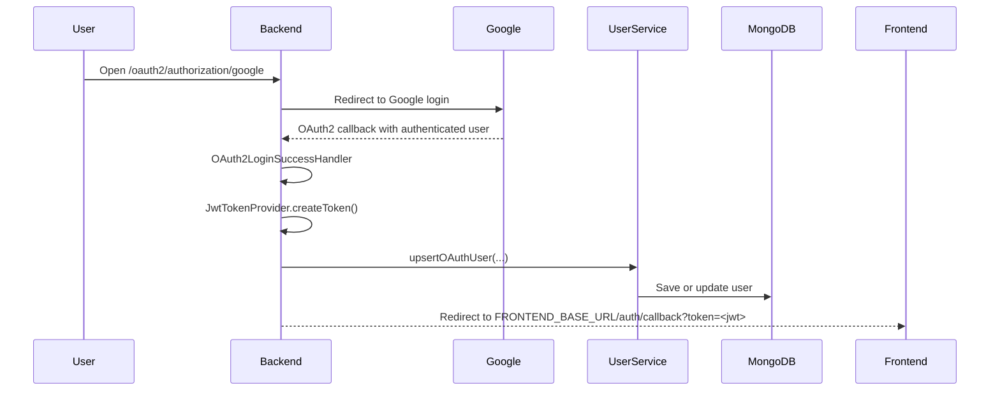

# Math-assistant Backend Documentation

Repository: `cpereiramt/Math-assistant`  
Project name: `MathExpAssistant`  
Current inspected branch: `main`  
Last inspected commit: `2a484dc9d5f264eba45f148bcfc7d403fcff5f44`  
Application type: Spring Boot backend API for storing, validating, and executing mathematical formulas.

## 1. Project Overview

Math-assistant is a Java 21 Spring Boot backend that exposes protected REST APIs for mathematical formula management and execution. The application stores formulas in MongoDB, authenticates users through Google OAuth2, issues JWT tokens for API access, and evaluates formula expressions with `exp4j`.

The backend supports two formula execution models:

1. Fixed formulas, where the formula has a stored equation and a fixed list of required parameters.
2. Variadic formulas, where the formula receives a dynamic ordered list of values and builds the equation at runtime using a configured operator.

The project also includes Docker support, local MongoDB support through Docker Compose, OpenAPI/Swagger documentation, actuator health endpoints, AWS Secrets Manager integration for production secrets, and a GitHub Actions workflow that builds, pushes, and deploys the Docker image to AWS infrastructure.

## 2. Main Capabilities

- Google OAuth2 login.
- JWT generation after successful OAuth2 authentication.
- JWT-protected API routes.
- User persistence and update on login.
- Formula creation with validation.
- Formula deletion with admin-only logic.
- Public formula listing.
- Formula lookup by name.
- Formula lookup by status.
- Fixed formula execution through named variables.
- Variadic formula execution through ordered values.
- MongoDB persistence for formulas and users.
- Swagger UI and OpenAPI schema.
- Actuator health and info endpoints.
- Resilience4j rate limiting and bulkhead protection on selected public API routes.
- Docker image build support.
- Local MongoDB through `docker-compose.yml`.
- Production secret loading from AWS Secrets Manager.
- CI/CD deployment workflow for AWS ECR and EC2.

## 3. Technology Stack

| Area | Technology |
| --- | --- |
| Language | Java 21 |
| Framework | Spring Boot 3.2.5 |
| Build tool | Gradle Wrapper |
| Web API | Spring Web |
| Security | Spring Security, OAuth2 Client, JWT |
| OAuth provider | Google |
| Database | MongoDB |
| Persistence | Spring Data MongoDB |
| Formula engine | exp4j |
| API docs | springdoc-openapi |
| Observability | Spring Boot Actuator, Micrometer Prometheus registry |
| Resilience | Resilience4j |
| Secrets | AWS Secrets Manager |
| Containerization | Docker |
| Local services | Docker Compose |
| CI/CD | GitHub Actions, AWS ECR, EC2 |

## 4. Repository Structure

```text
Math-assistant/
  .github/
    copilot-instructions.md
    workflows/
      aws-ec2-deploy.yml
  gradle/
    wrapper/
      gradle-wrapper.properties
  scripts/
    run-local.ps1
    run-local.sh
  src/
    main/
      java/com/claySoftware/MathExpAssistant/
        config/
        controllers/
        entities/
        helpers/
        models/
        repositories/
        services/
        utils/
        MathExpAssistantApplication.java
      resources/
        META-INF/spring.factories
        application.properties
        application-prod.yml
    test/
      java/com/claySoftware/MathExpAssistant/
      resources/application.properties
  .env.example
  build.gradle
  CHANGELOG.md
  docker-compose.yml
  DOCKER.md
  Dockerfile
  README.md
  settings.gradle
```

## 5. Application Entry Point

The main class is:

```text
src/main/java/com/claySoftware/MathExpAssistant/MathExpAssistantApplication.java
```

It is a standard Spring Boot entry point:

```java
SpringApplication.run(MathExpAssistantApplication.class, args);
```

Spring scans the package `com.claySoftware.MathExpAssistant` and discovers controllers, services, repositories, configuration classes, and components beneath that package.

## 6. High-Level Architecture

The backend follows a layered Spring architecture:



### Layer Responsibilities

| Layer | Responsibility |
| --- | --- |
| Controllers | Receive HTTP requests, apply route-level annotations, call services/repositories, return API responses. |
| Services | Hold business logic for formulas, users, and JWT generation. |
| Repositories | Abstract MongoDB access through Spring Data MongoDB repositories. |
| Entities | Define persisted MongoDB documents. |
| Models | Define enums and request models used by the API. |
| Helpers | Build equations, build variable maps, validate formulas, and evaluate expressions. |
| Config | Configure security, OpenAPI, exception handling, AWS secrets, OAuth2 success behavior, and JWT filtering. |
| Utils | Provide normalization and admin-plan helper logic. |

## 7. Runtime Request Flow

### Formula Execution Flow



### OAuth2 Login and JWT Flow



## 8. Build Configuration

The Gradle build file is:

```text
build.gradle
```

Important values:

- Group: `com.claySoftware`
- Version: `1.1.0`
- Java source compatibility: `21`
- Spring Boot plugin version: `3.2.5`
- Dependency management plugin version: `1.1.4`

Important dependencies:

- `spring-boot-starter-web`
- `spring-boot-starter-security`
- `spring-boot-starter-oauth2-client`
- `spring-boot-starter-data-mongodb`
- `spring-boot-starter-data-jpa`
- `spring-boot-starter-actuator`
- `spring-boot-starter-aop`
- `spring-boot-starter-validation`
- `jjwt`
- `exp4j`
- `springdoc-openapi-starter-webmvc-ui`
- `resilience4j-spring-boot3`
- `resilience4j-micrometer`
- `micrometer-registry-prometheus`
- `software.amazon.awssdk:secretsmanager`
- `lombok`
- `h2`
- `spring-boot-starter-test`
- `spring-security-test`

## 9. Configuration Files

### `application.properties`

Main application configuration lives in:

```text
src/main/resources/application.properties
```

It configures:

- Spring application name.
- Google OAuth2 client registration.
- MongoDB connection properties.
- JWT secret and expiration.
- Swagger/OpenAPI paths.
- Actuator exposure.
- Resilience4j rate limiter, bulkhead, thread pool bulkhead, circuit breaker, and time limiter values.

### `application-prod.yml`

Production profile configuration lives in:

```text
src/main/resources/application-prod.yml
```

It enables AWS secret loading:

```yaml
app:
  secrets:
    use-aws: true
aws:
  secrets:
     names: application_math_assistant
```

It also configures:

```yaml
server:
  forward-headers-strategy: framework
```

This is useful when running behind a reverse proxy or load balancer that forwards original request headers.

### `.env.example`

The example environment file documents the expected runtime values:

```text
SPRING_APPLICATION_NAME=MathExpAssistant
SPRING_PROFILES_ACTIVE=dev
MONGODB_URI=
MONGODB_HOST=localhost
MONGODB_PORT=27017
MONGODB_DATABASE=mathAssistant
MONGODB_USERNAME=admin
MONGODB_PASSWORD=admin123
MONGODB_AUTH_DB=admin
JWT_SECRET=replace_with_jwt_secret
JWT_EXPIRATION=3600000
OAUTH_GOOGLE_CLIENT_ID=
OAUTH_GOOGLE_CLIENT_SECRET=
OAUTH_GOOGLE_REDIRECT_URI=https://localhost:8080/login/oauth2/code/google
```

The application also references these values in code/configuration:

| Variable | Purpose |
| --- | --- |
| `SPRING_APPLICATION_NAME` | Spring application name. |
| `SPRING_PROFILES_ACTIVE` | Active runtime profile, such as `dev` or `prod`. |
| `MONGO_URI` / `MONGODB_URI` | MongoDB URI. The properties file currently references `MONGO_URI`; the example file uses `MONGODB_URI`, so this should be aligned. |
| `MONGODB_HOST` | MongoDB host. |
| `MONGODB_PORT` | MongoDB port. |
| `MONGODB_DATABASE` | MongoDB database name. |
| `MONGODB_USERNAME` | MongoDB username. |
| `MONGODB_PASSWORD` | MongoDB password. |
| `MONGODB_AUTH_DB` | MongoDB authentication database. |
| `JWT_SECRET` | Secret used to sign JWT tokens. |
| `JWT_EXPIRATION` | JWT expiration time in milliseconds. |
| `OAUTH_GOOGLE_CLIENT_ID` | Google OAuth client ID. |
| `OAUTH_GOOGLE_CLIENT_SECRET` | Google OAuth client secret. |
| `OAUTH_GOOGLE_REDIRECT_URI` | Google OAuth redirect URI. |
| `FRONTEND_BASE_URL` | Used by `OAuth2LoginSuccessHandler` to redirect after login. |
| `ADMIN_CREDS` | Used by `AdminBypass` to decide admin access and premium plan. |
| `USE_AWS_SECRETS` | Enables AWS Secrets Manager loading when set to `true`. |
| `AWS_SECRETS_NAMES` | Comma-separated AWS secret names when not using `aws.secrets.names`. |

## 10. Local Development Setup

### Prerequisites

- Java 21.
- Docker Desktop or another Docker runtime.
- Git.
- Internet access for Gradle dependency resolution.
- A Google OAuth2 client if testing real login.

### Step 1: Start MongoDB

The repository includes a MongoDB service in `docker-compose.yml`.

```powershell
docker-compose up -d
```

This starts MongoDB on port `27017` with:

```text
Username: admin
Password: admin123
Database: mathAssistant
Auth DB: admin
```

### Step 2: Create Local Environment File

Copy:

```text
.env.example
```

to:

```text
.env
```

Then fill the values needed for local execution.

Important: `.env` is ignored by Git and should not be committed.

### Step 3: Run Locally on Windows

Use the PowerShell helper:

```powershell
powershell -NoProfile -ExecutionPolicy Bypass -File .\scripts\run-local.ps1
```

Or run Gradle directly after setting environment variables:

```powershell
.\gradlew.bat bootRun
```

### Step 4: Run Locally on Unix/macOS/Linux

```bash
chmod +x ./scripts/run-local.sh
./scripts/run-local.sh
```

Or:

```bash
./gradlew bootRun
```

### Step 5: Build

Windows:

```powershell
.\gradlew.bat build
```

Unix/macOS/Linux:

```bash
./gradlew build
```

### Step 6: Run Tests

Windows:

```powershell
.\gradlew.bat test
```

Unix/macOS/Linux:

```bash
./gradlew test
```

## 11. Docker Usage

### Build Image

```bash
docker build -t math-assistant:latest .
```

### Run Container

```bash
docker run -p 8080:8080 --env-file .env --name math-assistant math-assistant:latest
```

### Dockerfile Behavior

The `Dockerfile` uses a multi-stage build:

1. Build stage:
   - Base image: `eclipse-temurin:21-jdk`
   - Copies the repository into `/app`
   - Runs `./gradlew --no-daemon clean bootJar -x test`

2. Runtime stage:
   - Base image: `eclipse-temurin:21-jre`
   - Copies the built JAR to `/app/app.jar`
   - Exposes port `8080`
   - Sets `SPRING_PROFILES_ACTIVE=prod`
   - Runs `java -jar /app/app.jar`

## 12. Security Architecture

Security is configured in:

```text
src/main/java/com/claySoftware/MathExpAssistant/config/SecurityConfig.java
```

The application uses:

- Google OAuth2 login for browser authentication.
- JWT bearer tokens for API access.
- A custom `JwtAuthenticationFilter`.
- A custom `ApiAuthenticationEntryPoint`.
- A custom OAuth2 login success handler.
- CORS restrictions for the frontend domain.

### Public Routes

The following route groups are explicitly permitted:

```text
/docs/**
/v3/api-docs/**
/swagger-ui/**
/swagger-ui.html
/actuator/**
/oauth2/**
/login/oauth2/**
/error
OPTIONS /**
```

### Authenticated Routes

The following routes require authentication:

```text
/auth/token
/api/**
```

All other routes are denied.

### JWT Filter

The JWT filter:

1. Reads the `Authorization` header.
2. Checks for the `Bearer ` prefix.
3. Parses the token using `jwt.secret`.
4. Extracts the JWT subject.
5. Creates a Spring Security authentication object.
6. Stores it in `SecurityContextHolder`.

If token parsing fails, the exception is ignored and the request continues without authentication. Spring Security then decides whether the target route can be accessed.

### JWT Claims

JWT tokens generated by `JwtTokenProvider` include:

| Claim | Source |
| --- | --- |
| Subject | OIDC user name |
| `email` | Google OIDC email |
| `plan` | `FREE` or `PREMIUM` |
| `role` | `USER` or `ADMIN` |
| Issued at | Current time |
| Expiration | Current time plus `jwt.expiration` |

### OAuth2 Success Flow

After successful Google login:

1. `OAuth2LoginSuccessHandler` receives the authenticated user.
2. It calls `JwtTokenProvider.createToken(authentication)`.
3. The user is inserted or updated in MongoDB.
4. The backend redirects to:

```text
{FRONTEND_BASE_URL}/auth/callback?token={jwt}
```

### Admin Logic

Admin behavior is centralized in:

```text
src/main/java/com/claySoftware/MathExpAssistant/utils/AdminBypass.java
```

It reads:

```text
ADMIN_CREDS
```

from the environment and compares it to the provided email using a case-insensitive match.

Admin users receive:

```text
role = ADMIN
plan = PREMIUM
```

Non-admin users receive:

```text
role = USER
plan = FREE
```

Note: the current `JwtTokenProvider` calls `adminBypass.effectivePlan(sub)` and `adminBypass.isAdminEmail(sub)`, passing the Google subject instead of the email. The delete endpoint checks admin access against `authentication.getName()`, which is the JWT subject from the token filter. If admin checks are expected to use email, this should be reviewed.

### CORS

CORS is configured to allow:

```text
https://math-assistant.claytonpereira.com
```

Allowed methods:

```text
GET, POST, PUT, DELETE, OPTIONS
```

Allowed headers:

```text
Authorization, Content-Type, Accept, Origin
```

Credentials are allowed.

## 13. API Documentation

Swagger UI is available at:

```text
/docs
```

OpenAPI JSON is available at:

```text
/docs/v3/api-docs
```

The OpenAPI configuration defines a bearer authentication scheme named:

```text
bearerAuth
```

## 14. API Endpoints

### Authentication Controller

Base path:

```text
/auth
```

Controller:

```text
AuthController
```

#### `GET /auth/token`

Returns a JWT token for the currently authenticated OAuth2 user.

Authentication:

- Requires an authenticated Google OAuth2 session.

Response example:

```json
{
  "token": "eyJhbGciOiJIUzUxMiJ9..."
}
```

### Formula Controller

Base path:

```text
/api/formulas
```

Controller:

```text
FormulaController
```

All routes under `/api/**` require authentication.

#### `POST /api/formulas/execute`

Executes a formula by name.

Behavior:

- Looks up the formula by `formulaName`.
- If `variable = false`, executes a fixed formula using `variables`.
- If `variable = true`, executes a variadic formula using `values`.
- Returns the result as a plain string.
- Returns validation, not found, server, or calculation errors as plain strings.

Fixed formula request:

```json
{
  "formulaName": "RECTANGLE_AREA",
  "variables": {
    "BASE": 10,
    "HEIGHT": 5
  }
}
```

Variadic formula request:

```json
{
  "formulaName": "ADDITION",
  "values": [1, 2, 3, 2, 3, 2]
}
```

Successful response example:

```text
21.0
```

Possible error responses:

```text
validation_error: request body is required
validation_error: formulaName is required
not_found: formula not found on database
validation_error: variables is required for fixed formulas
server_error: fixed formula missing parameters configuration
server_error: fixed formula missing equation configuration
validation_error: some parameters are not provided. Expected: [...]
validation_error: extra parameters provided. Expected only: [...]
validation_error: values is required for variadic formulas
server_error: variadic formula missing operator configuration
validation_error: at least N values are required
validation_error: at most N values are allowed
calculation_error: ...
```

Resilience:

- Rate limiter: `publicApi`
- Bulkhead: `publicApi`

Fallback behavior:

- Rate limit failure returns HTTP 429 with message `Too Many Requests`.
- Bulkhead failure returns HTTP 429 with message `Server busy`.

#### `POST /api/formulas/insert`

Creates a new formula.

Behavior:

1. Normalizes equation to uppercase.
2. Normalizes parameters to uppercase.
3. Sets status to `UNDER_REVIEW`.
4. Converts formula name to uppercase.
5. Validates the formula.
6. Rejects duplicate names.
7. Saves the formula in MongoDB.

Fixed formula request:

```json
{
  "name": "RECTANGLE_AREA",
  "group": "GEOMETRY",
  "variable": false,
  "equation": "BASE * HEIGHT",
  "parameters": ["BASE", "HEIGHT"]
}
```

Variadic formula request:

```json
{
  "name": "ADDITION",
  "group": "ARITHMETIC",
  "variable": true,
  "operator": "+",
  "minParameters": 1,
  "maxParameters": 100
}
```

Successful response:

```text
new formula successful saved
```

Possible error responses:

```text
validation_error: Payload is required
validation_error: name is required
validation_error: group is required
validation_error: equation is required for fixed formulas
validation_error: parameters is required for fixed formulas
validation_error: operator must be empty for fixed formulas
validation_error: invalid parameter name: ...
validation_error: duplicate parameter: ...
validation_error: operator is required for variadic formulas
validation_error: unsupported operator for variadic formula: ...
validation_error: minParams must be >= 1
validation_error: maxParams must be >= 1
validation_error: maxParams must be >= minParams
validation_error: parameters must be empty for variadic formulas
Formula already exists
```

Resilience:

- Rate limiter: `publicApi`
- Bulkhead: `publicApi`

#### `DELETE /api/formulas/delete/{id}`

Deletes a formula by MongoDB document ID.

Behavior:

1. Loads the formula by ID.
2. Reads the authenticated user name.
3. Checks admin access through `AdminBypass`.
4. Deletes the formula if it exists and the user is admin.

Responses:

```text
Access denied
formula deleted with success !
formula not found !
```

#### `GET /api/formulas/getAll`

Returns all formulas with status:

```text
PUBLIC
```

Response example:

```json
[
  {
    "id": "...",
    "name": "ADDITION",
    "group": "ARITHMETIC",
    "equation": null,
    "parameters": [],
    "status": "PUBLIC",
    "variable": true,
    "minParameters": 1,
    "maxParameters": 100,
    "operator": "+"
  }
]
```

Resilience:

- Rate limiter: `publicApi`
- Bulkhead: `publicApi`

#### `GET /api/formulas/name/{name}`

Returns a formula by name.

Behavior:

- Converts `{name}` to uppercase.
- Calls `FormulaRepository.findByName`.

Response:

- `Optional<FormulaEntity>` serialized by Spring.

#### `GET /api/formulas/status/{status}`

Returns formulas by status.

Behavior:

- Converts `{status}` to uppercase.
- Calls `FormulaRepository.findAllByStatus`.

Response:

- `Optional<List<FormulaEntity>>` serialized by Spring.

## 15. Data Model

### FormulaEntity

MongoDB collection:

```text
formulas
```

Class:

```text
src/main/java/com/claySoftware/MathExpAssistant/entities/FormulaEntity.java
```

Fields:

| Field | Type | Description |
| --- | --- | --- |
| `id` | `String` | MongoDB document ID. |
| `name` | `String` | Formula name, normalized to uppercase on insert. |
| `group` | `FormulaGroup` | Formula category. |
| `equation` | `String` | Stored expression for fixed formulas. |
| `parameters` | `List<String>` | Required variable names for fixed formulas. |
| `status` | `FormulaStatus` | Visibility/review status. |
| `variable` | `boolean` | Indicates whether the formula is variadic. |
| `minParameters` | `int` | Minimum number of values for variadic formulas. |
| `maxParameters` | `int` | Maximum number of values for variadic formulas. |
| `operator` | `String` | Operator used to build variadic equations. |

Indexes:

```java
@CompoundIndex(name = "unique_name_group", def = "{'name': 1, 'group': 1}", unique = true)
```

This index enforces uniqueness for the combination of `name` and `group`.

### UserEntity

MongoDB collection:

```text
users
```

Class:

```text
src/main/java/com/claySoftware/MathExpAssistant/entities/UserEntity.java
```

Fields:

| Field | Type | Description |
| --- | --- | --- |
| `id` | `String` | MongoDB document ID. |
| `provider` | `String` | OAuth provider, currently `google`. |
| `providerUserId` | `String` | Stable user identifier from Google OIDC `sub`. Unique. |
| `email` | `String` | User email. Unique. |
| `name` | `String` | User display name. |
| `pictureUrl` | `String` | User profile image URL. |
| `plan` | `UserPlan` | `FREE` or `PREMIUM`. |
| `createdAt` | `Instant` | First creation timestamp. |
| `updatedAt` | `Instant` | Last update timestamp. |
| `lastLoginAt` | `Instant` | Last login timestamp. |
| `role` | `String` | `USER` or `ADMIN`. |

Indexes:

- `provider`
- `providerUserId`, unique
- `email`, unique

## 16. Enums and Request Models

### FormulaGroup

Possible formula groups:

```text
ARITHMETIC
TRIGONOMETRY
ALGEBRA
PERCENTAGE
GEOMETRY
```

### FormulaStatus

Possible formula statuses:

```text
PUBLIC
PRIVATE
DEPRECATED
UNDER_REVIEW
```

### UserPlan

Possible user plans:

```text
FREE
PREMIUM
```

### ExecuteFormulaRequest

Request model for formula execution:

| Field | Type | Used by |
| --- | --- | --- |
| `formulaName` | `String` | Fixed and variadic formulas. |
| `variables` | `Map<String, Double>` | Fixed formulas. |
| `values` | `List<Double>` | Variadic formulas. |

## 17. Formula Execution Rules

### Fixed Formulas

A fixed formula has:

- `variable = false`
- `equation` filled.
- `parameters` filled.
- `operator` empty or null.

Example:

```json
{
  "name": "RECTANGLE_AREA",
  "group": "GEOMETRY",
  "variable": false,
  "equation": "BASE * HEIGHT",
  "parameters": ["BASE", "HEIGHT"],
  "status": "PUBLIC"
}
```

Execution request:

```json
{
  "formulaName": "RECTANGLE_AREA",
  "variables": {
    "BASE": 10,
    "HEIGHT": 5
  }
}
```

Execution process:

1. Load formula by name.
2. Verify `variables` is present.
3. Verify formula has configured parameters.
4. Verify formula has configured equation.
5. Verify request contains all expected parameters.
6. Verify request does not contain extra parameters.
7. Normalize variable names to uppercase.
8. Execute the expression through `FormulaExecutor`.
9. Return the result as a string.

### Variadic Formulas

A variadic formula has:

- `variable = true`
- `operator` filled.
- `parameters` empty.
- `equation` optional.
- `minParameters` and `maxParameters` optional.

Example:

```json
{
  "name": "ADDITION",
  "group": "ARITHMETIC",
  "variable": true,
  "operator": "+",
  "minParameters": 1,
  "maxParameters": 100,
  "status": "PUBLIC"
}
```

Execution request:

```json
{
  "formulaName": "ADDITION",
  "values": [1, 2, 3, 4]
}
```

Execution process:

1. Load formula by name.
2. Verify `values` is present and not empty.
3. Verify formula has an operator.
4. Validate the number of values against `minParameters` and `maxParameters`.
5. Build an expression using `EquationBuilder`.
6. Build variables using `VariableBuilder`.
7. Execute the expression through `FormulaExecutor`.
8. Return the result as a string.

For the request above, the backend builds:

```text
X1 + X2 + X3 + X4
```

and variables:

```json
{
  "X1": 1,
  "X2": 2,
  "X3": 3,
  "X4": 4
}
```

### Supported Variadic Operators

Validation currently allows:

```text
+
*
-
/
```

The operator is inserted between all generated variables. For example, values `[10, 2, 3]` with `/` become:

```text
X1 / X2 / X3
```

## 18. Helper Classes

### FormulaExecutor

Class:

```text
helpers/FormulaExecutor.java
```

Responsibility:

- Builds an exp4j `Expression`.
- Registers variable names.
- Sets variable values.
- Evaluates and returns a `double`.

### FormulaValidator

Class:

```text
helpers/FormulaValidator.java
```

Responsibility:

- Validates formula payloads before insert.
- Applies separate fixed and variadic formula rules.
- Validates parameter naming.
- Validates duplicate parameters.
- Validates supported variadic operators.
- Validates min/max parameter counts.

### EquationBuilder

Class:

```text
helpers/EquationBuilder.java
```

Responsibility:

- Builds variadic equations from an operator and a number of variables.

Example:

```java
EquationBuilder.buildVariadicEquation("+", 3)
```

returns:

```text
X1 + X2 + X3
```

### VariableBuilder

Class:

```text
helpers/VariableBuilder.java
```

Responsibility:

- Converts ordered values into variable names.

Example:

```json
[5, 10, 20]
```

becomes:

```json
{
  "X1": 5,
  "X2": 10,
  "X3": 20
}
```

### FormulaNormalizer

Class:

```text
utils/FormulaNormalizer.java
```

Responsibility:

- Trims and uppercases equations.
- Trims and uppercases parameter names.
- Trims and uppercases variable names in execution requests.

### VariadicValidator

Class:

```text
helpers/VariadicValidator.java
```

Responsibility:

- Infers a variable count from a map of `X1..Xn` variable names.
- Validates continuous variadic variable names.

Current status:

- Present in the codebase.
- Not used by the current `FormulaService`, because current variadic execution uses `values` instead of a variables map.

## 19. Persistence Layer

### FormulaRepository

Extends:

```java
MongoRepository<FormulaEntity, String>
```

Methods:

```java
Optional<FormulaEntity> findByName(String name);
Optional<List<FormulaEntity>> findAllByStatus(String status);
```

### UserRepository

Extends:

```java
MongoRepository<UserEntity, String>
```

Methods:

```java
Optional<UserEntity> findByProviderUserId(String providerUserId);
Optional<UserEntity> findByEmail(String email);
```

## 20. Error Handling

Global exception handling lives in:

```text
config/GlobalExceptionHandler.java
```

It handles:

- `MethodArgumentNotValidException`
- `MongoWriteException`

Validation errors are returned as a map:

```json
{
  "fieldName": "error message"
}
```

Mongo write errors are returned as:

```json
{
  "error": "localized mongo error"
}
```

Many formula service errors are currently returned as plain strings instead of structured JSON. This is an existing API behavior and should be preserved unless clients are updated.

## 21. Resilience and Rate Limits

Resilience4j is configured in `application.properties`.

### Rate Limiter

`publicApi`:

```text
limitForPeriod = 100
limitRefreshPeriod = 10s
timeoutDuration = 0
```

`login`:

```text
limitForPeriod = 10
limitRefreshPeriod = 1s
timeoutDuration = 0
```

### Bulkhead

`publicApi`:

```text
maxConcurrentCalls = 100
maxWaitDuration = 0
```

### Thread Pool Bulkhead

`externalCalls`:

```text
coreThreadPoolSize = 20
maxThreadPoolSize = 50
queueCapacity = 200
```

### Circuit Breaker

Default configuration:

```text
slidingWindowType = COUNT_BASED
slidingWindowSize = 50
failureRateThreshold = 50
slowCallRateThreshold = 50
slowCallDurationThreshold = 2s
minimumNumberOfCalls = 20
permittedNumberOfCallsInHalfOpenState = 10
waitDurationInOpenState = 10s
automaticTransitionFromOpenToHalfOpenEnabled = true
```

Configured recorded exceptions:

- `java.io.IOException`
- `java.net.SocketTimeoutException`
- `org.springframework.web.client.ResourceAccessException`

Configured instance:

```text
dbOrExternal
```

### Time Limiter

`externalCalls`:

```text
timeoutDuration = 2s
cancelRunningFuture = true
```

## 22. Observability

The project includes:

- Spring Boot Actuator.
- Micrometer Prometheus registry.
- Actuator route exposure for health and info.

Configured exposure:

```text
management.endpoints.web.exposure.include = health,info
```

Health details:

```text
endpoint.health.show-details = when_authorized
```

Actuator endpoints are allowed without authentication by `SecurityConfig`.

## 23. AWS Secrets Manager Integration

AWS secret loading is implemented in:

```text
config/AwsSecretsEnvironmentPostProcessor.java
```

It is registered through:

```text
src/main/resources/META-INF/spring.factories
```

Registration:

```text
org.springframework.boot.env.EnvironmentPostProcessor=\
com.claySoftware.MathExpAssistant.config.AwsSecretsEnvironmentPostProcessor
```

The loader is enabled when any of these are true:

- `USE_AWS_SECRETS=true`
- The active profile includes `prod`
- `app.secrets.use-aws=true`

Secret names are read from:

- `aws.secrets.names`
- or `AWS_SECRETS_NAMES`

The loader expects each secret to contain either:

1. A JSON object, where each key/value is injected into the Spring environment.
2. A raw string, which is injected under the secret name key.

If AWS secret loading is enabled but no secret names are configured, startup fails.

If a secret cannot be loaded, startup fails.

## 24. CI/CD Deployment

Workflow file:

```text
.github/workflows/aws-ec2-deploy.yml
```

Trigger:

```text
push to main
```

Deployment steps:

1. Checkout source.
2. Set up Java 21.
3. Grant execute permission to `gradlew`.
4. Build with Gradle:

```bash
./gradlew clean build -x test
```

5. Configure AWS credentials from GitHub secrets.
6. Log in to Amazon ECR.
7. Build Docker image.
8. Tag image as latest.
9. Push image to ECR.
10. SSH into EC2.
11. Pull latest image.
12. Stop and remove existing container named `app`.
13. Run new container on port `8080`.

Required GitHub secrets:

| Secret | Purpose |
| --- | --- |
| `AWS_ACCESS_KEY_ID` | AWS access key. |
| `AWS_SECRET_ACCESS_KEY` | AWS secret key. |
| `AWS_REGION` | AWS region used by CI. |
| `ECR_REGISTRY` | ECR registry used for login. |
| `ECR_REPOSITORY` | ECR repository/image URL. |
| `EC2_HOST` | EC2 host address. |
| `EC2_USER` | SSH user. |
| `EC2_SSH_KEY` | Private key for SSH deployment. |

Note: the EC2 script logs in to ECR using hardcoded region `us-east-1`, while earlier workflow steps use `${{ secrets.AWS_REGION }}`. If the repository is deployed outside `us-east-1`, align these values.

## 25. Testing

Test files currently present:

```text
src/test/java/com/claySoftware/MathExpAssistant/MathExpAssistantApplicationTests.java
src/test/java/com/claySoftware/MathExpAssistant/JWTIntegrationTest.java
src/test/resources/application.properties
```

The integration test attempts to:

1. Generate a JWT using `YOUR_SECRET_KEY`.
2. Send it as a bearer token.
3. Call `/login`.
4. Expect HTTP 200 and response content containing `Google`.

Important testing notes:

- `/login` is not explicitly defined as a public route in the current `SecurityConfig`; OAuth2-related routes are configured under `/oauth2/**` and `/login/oauth2/**`.
- The test JWT secret should match configured `jwt.secret`.
- MongoDB may be required for tests that load the full application context if repositories/services connect during startup.
- The GitHub Actions deployment build currently skips tests with `-x test`.

Recommended future test coverage:

- Unit tests for `FormulaValidator`.
- Unit tests for `EquationBuilder`.
- Unit tests for `VariableBuilder`.
- Unit tests for `FormulaNormalizer`.
- Service tests for fixed formula execution.
- Service tests for variadic formula execution.
- Controller tests for authentication failures.
- Controller tests for rate limit and bulkhead fallback behavior.
- Integration tests for OAuth/JWT behavior using stable test configuration.

## 26. Known Implementation Notes and Review Items

These are observations from the current source code that are worth reviewing as the project evolves.

### MongoDB URI Variable Name Mismatch

`application.properties` uses:

```text
spring.data.mongodb.uri=${MONGO_URI}
```

`.env.example` uses:

```text
MONGODB_URI=
```

Recommendation:

- Align both to the same variable name.
- Prefer one clear name, such as `MONGODB_URI`.

### Admin Email Check May Use the Wrong Identifier

`JwtTokenProvider` extracts:

- `sub` from Google OIDC subject.
- `email` from Google OIDC email.

But admin logic currently checks `sub`:

```java
adminBypass.effectivePlan(sub)
adminBypass.isAdminEmail(sub)
```

The helper name and environment variable `ADMIN_CREDS` suggest that email should be used.

Recommendation:

- Confirm whether `ADMIN_CREDS` stores an email or Google subject.
- If it stores an email, call admin checks with `email`.

### Delete Endpoint Admin Check Depends on Authentication Name

The delete endpoint uses:

```java
String email = (String) authentication.getName();
```

The JWT filter creates a user using the JWT subject, not the email claim. The JWT subject is currently the OIDC user name.

Recommendation:

- If admin deletion should depend on email, extract the email claim from the JWT and expose it in the authentication principal or authorities.

### Test Configuration Should Be Revisited

`JWTIntegrationTest` signs with:

```text
YOUR_SECRET_KEY
```

but test properties use:

```text
jwt.secret=mySecretTempKeyForDevOnlyChangeInProd
```

Recommendation:

- Use `jwtTokenProvider.getJwtSecret()` or inject the test property.
- Update the tested endpoint to match the current security flow.

### API Response Shape Is Mixed

Some endpoints return plain strings, others return entities/lists, and global exceptions return JSON maps.

Recommendation:

- Keep current behavior if clients already depend on it.
- For a future major version, consider a consistent response envelope.

### Unused Imports and Unused Helper

Some classes include unused imports.

`VariadicValidator` exists but is not used in the current variadic execution flow.

Recommendation:

- Remove unused code if it is no longer part of the intended design.
- Or document future use if `variables`-based variadic execution will return.

### Dependency Version Alignment

The project uses Spring Boot 3.2.5 but explicitly includes:

```text
spring-boot-starter-validation:2.2.1.RELEASE
spring-boot-starter-data-mongodb:3.3.3
```

Recommendation:

- Prefer Spring Boot dependency management versions unless there is a specific reason to override.
- Review compatibility with Spring Boot 3.2.5.

## 27. Development Conventions

Existing conventions in the project:

- Package root is `com.claySoftware.MathExpAssistant`.
- Controllers live in `controllers`.
- Services live in `services`.
- MongoDB repositories live in `repositories`.
- MongoDB documents live in `entities`.
- Request models and enums live in `models`.
- Reusable formula logic lives in `helpers`.
- Cross-cutting utilities live in `utils`.
- Security and infrastructure configuration live in `config`.
- Formula names and parameters are normalized to uppercase.
- Formula API responses often use plain human-readable strings.
- Formula insertions are set to `UNDER_REVIEW` by default.
- Public formula listing only returns `PUBLIC` formulas.

## 28. Recommended Operational Checklist

Before running locally:

- Java 21 is installed.
- Docker is running.
- MongoDB container is up.
- `.env` exists and contains required variables.
- Google OAuth credentials are configured if login is being tested.
- `JWT_SECRET` is not the placeholder value.

Before deploying:

- AWS credentials are configured in GitHub secrets.
- ECR repository exists.
- EC2 instance can pull from ECR.
- EC2 instance has Docker installed.
- Runtime secrets are available through AWS Secrets Manager or injected environment variables.
- `FRONTEND_BASE_URL` is configured.
- `ADMIN_CREDS` is configured if admin operations are required.
- CORS allowed origins include the deployed frontend.
- OAuth redirect URI matches the deployed backend callback.

Before changing formula behavior:

- Add or update tests for fixed formulas.
- Add or update tests for variadic formulas.
- Confirm response strings used by frontend clients.
- Confirm normalization behavior for names, parameters, and variables.

## 29. Suggested Roadmap

Short-term improvements:

- Align MongoDB environment variable names.
- Fix or update JWT integration tests.
- Add unit tests for formula validation and execution.
- Review admin identity logic.
- Add structured error documentation to Swagger.
- Remove unused imports and unused helper code if not needed.

Medium-term improvements:

- Add paging/filtering for formula listing.
- Add explicit admin role authorization instead of manual string checks.
- Add formula update and approval endpoints.
- Add audit timestamps to formulas.
- Add ownership information to formulas.
- Add cache for formula lookup as noted in `FormulaService`.
- Add more complete OpenAPI annotations.

Long-term improvements:

- Introduce consistent API response envelopes.
- Add formula versioning.
- Add per-plan rate limits.
- Add frontend-specific examples for web and mobile clients.
- Add monitoring dashboards using Prometheus metrics.
- Add automated deployment verification after EC2 rollout.

## 30. Quick Reference

### Important Commands

```powershell
docker-compose up -d
.\gradlew.bat build
.\gradlew.bat bootRun
.\gradlew.bat test
powershell -NoProfile -ExecutionPolicy Bypass -File .\scripts\run-local.ps1
```

```bash
docker-compose up -d
./gradlew build
./gradlew bootRun
./gradlew test
chmod +x ./scripts/run-local.sh
./scripts/run-local.sh
```

### Important URLs

```text
Swagger UI: /docs
OpenAPI JSON: /docs/v3/api-docs
Actuator health: /actuator/health
Google OAuth start: /oauth2/authorization/google
JWT token: /auth/token
Formula API base: /api/formulas
```

### Important Classes

```text
MathExpAssistantApplication
SecurityConfig
JwtAuthenticationFilter
JwtTokenProvider
OAuth2LoginSuccessHandler
ApiAuthenticationEntryPoint
AwsSecretsEnvironmentPostProcessor
FormulaController
AuthController
FormulaService
UserService
FormulaRepository
UserRepository
FormulaEntity
UserEntity
FormulaExecutor
FormulaValidator
EquationBuilder
VariableBuilder
FormulaNormalizer
AdminBypass
```

## 31. Summary

Math-assistant is a Spring Boot backend focused on authenticated mathematical formula execution. Its core value is the formula execution pipeline: formulas are stored in MongoDB, normalized and validated before persistence, retrieved by name, and evaluated with `exp4j` using either fixed named variables or dynamically generated variadic variables.

The current implementation already includes the essential backend foundation: OAuth2 login, JWT protection, MongoDB persistence, formula validation, Docker support, production secret loading, Swagger documentation, resilience configuration, and AWS deployment automation. The most important next engineering steps are tightening identity/admin handling, aligning environment variables, strengthening tests, and improving response consistency when the frontend contract allows it.
